# 🤖 ETF 포트폴리오 동적 자산배분 강화학습 콘솔

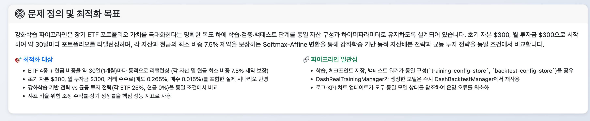

## 📘 프로젝트 과제 지침 반영 내용

### 0. 실행 방법

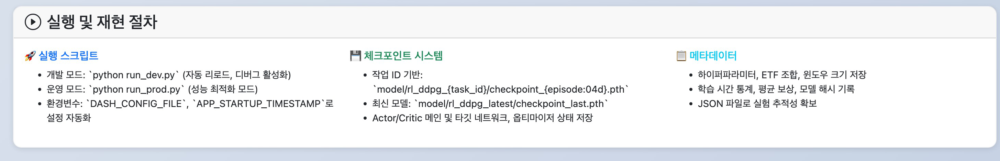

본 프로젝트는 환경변수 기반 설정 시스템을 통해 개발 및 운영 환경을 구분하여 실행할 수 있습니다.

#### 0.1. 환경 설정

**uv 설치 및 가상환경 구성**:

프로젝트는 [uv](https://docs.astral.sh/uv/)를 통해 Python 인터프리터와 의존성을 관리합니다.

```bash
# uv 설치 (macOS/Linux)
curl -LsSf https://astral.sh/uv/install.sh | sh

# Homebrew 사용 시
brew install uv

# 프로젝트 루트에서 가상환경 생성
uv venv .venv

# 가상환경 활성화 (zsh/bash)
source .venv/bin/activate
```

**의존성 설치**:

```bash
# requirements.txt 기반 설치
uv pip install -r requirements.txt

# 또는 기존 pip 사용
pip install -r requirements.txt
```

> **참고**: uv는 캐싱·격리 덕분에 더 빠르고 안정적이지만, 기존 `pip install -r requirements.txt`도 사용 가능합니다.

**설정 파일 생성**:

프로젝트 루트 디렉토리에 `config.env` 파일을 생성하고 다음 내용을 추가합니다:

```bash
# API Keys
API_KEY_FRED=

# Dash Application Settings
DASH_DEBUG=true
DASH_AUTO_RELOAD=true
DASH_DEV_TOOLS_UI=true
DASH_DEV_TOOLS_PROPS_CHECK=true
DASH_HOST=0.0.0.0
DASH_PORT=8050

# Development Settings
DASH_SERVE_DEV_BUNDLES=true
DASH_HOT_RELOAD=true
```

**API 키 발급**:

- **API_KEY_FRED**: [FRED (Federal Reserve Economic Data)](https://fred.stlouisfed.org/docs/api/api_key.html)에서 무료로 API 키를 발급받을 수 있습니다. FRED API 키는 시장 지표 데이터(VIX 등)를 가져오는 데 사용됩니다.
  1. [FRED API 키 발급 페이지](https://fred.stlouisfed.org/docs/api/api_key.html)에 접속
  2. 계정 생성 또는 로그인
  3. API 키 발급 후 `config.env` 파일의 `API_KEY_FRED=` 뒤에 발급받은 키를 입력

> **주의**: `config.env` 파일은 민감한 정보를 포함할 수 있으므로 Git에 커밋하지 않도록 주의하세요. 프로젝트의 `.gitignore` 파일에 이미 포함되어 있습니다.

**VSCode Python 인터프리터 설정** (선택사항):

1. VSCode 명령 팔레트 (`Cmd+Shift+P` 또는 `Ctrl+Shift+P`) 실행
2. `Python: Select Interpreter` 입력 후 선택
3. `${workspaceFolder}/.venv/bin/python` 인터프리터를 선택
4. `.vscode/settings.json`에 `"python.defaultInterpreterPath"`가 이미 지정되어 있어 최초 선택 후 자동 유지됩니다.

#### 0.2. 애플리케이션 실행

**환경변수 기반 설정 시스템**:

프로젝트는 환경변수를 통해 자동 리로드 및 개발 도구를 제어할 수 있습니다.

```bash
# 개발 모드 (자동 리로드 활성화)
python run_dev.py

# 운영 모드 (자동 리로드 비활성화, 성능 최적화)
python run_prod.py

# 기본 실행
python dash_interface_complete_refactored.py
```

**설정 파일별 실행**:

```bash
# 개발 환경 설정
export DASH_CONFIG_FILE=config.development.env
python dash_interface_complete_refactored.py

# 운영 환경 설정
export DASH_CONFIG_FILE=config.production.env
python dash_interface_complete_refactored.py
```

**Auto-Reload 제어**:

`config.env` 파일에서 자동 리로드 설정을 변경할 수 있습니다:

```bash
DASH_AUTO_RELOAD=true     # 자동 리로드 활성화
DASH_AUTO_RELOAD=false    # 자동 리로드 비활성화
```

#### 0.3. 웹 브라우저 접속

애플리케이션 실행 후 다음 주소로 접속합니다:

- **로컬 접속**: <http://127.0.0.1:8050>
- **네트워크 접속**: http://[로컬IP]:8050

실행 시 현재 적용된 설정이 콘솔에 표시됩니다:

```text
🔧 DASH 애플리케이션 설정
============================================================
🌐 서버: 0.0.0.0:8050
🐛 디버그 모드: ✅
🔄 자동 리로드: ✅ / ❌
🛠️ 개발 도구 UI: ✅
📊 속성 검사: ✅
🔥 핫 리로드: ✅
📦 개발 번들 제공: ✅
============================================================
```

#### 0.4. 학습된 모델 저장 및 다운로드

**모델 저장 위치**:

학습된 DDPG 모델은 다음 두 위치에 자동으로 저장됩니다:

1. **작업 ID 기반 디렉토리**: `model/rl_ddpg_{task_id}/`
   - 각 학습 작업마다 고유한 작업 ID로 구분
   - 예: `model/rl_ddpg_14072658/`

2. **최신 체크포인트 디렉토리**: `model/rl_ddpg_latest/`
   - 가장 최근에 학습된 모델을 항상 유지
   - 백테스트에서 기본적으로 사용되는 모델

**저장되는 파일 형식**:

각 모델 디렉토리에는 다음 파일들이 저장됩니다:

- **체크포인트 파일** (`.pth`):
  - `checkpoint_{episode:04d}.pth`: 특정 에피소드의 모델 상태
  - `checkpoint_last.pth`: 가장 최근 에피소드의 모델 상태
  - 포함 내용: Actor/Critic 메인 및 타겟 네트워크 상태, 옵티마이저 상태

- **메타데이터 파일** (`.json`):
  - `metadata_{episode:04d}.json`: 특정 에피소드의 학습 메타데이터
  - `metadata_last.json`: 가장 최근 에피소드의 학습 메타데이터
  - 포함 내용:
    - 학습 설정: 하이퍼파라미터(학습률, 배치 크기, 은닉층 차원), ETF 조합, 윈도우 크기
    - 학습 진행 상황: 현재 에피소드, 총 에피소드, 평균 보상
    - 학습 시간 통계: 총 학습 시간, 평균 에피소드 시간, 예상 남은 시간, 학습 효율성
    - 모델 정보: 모델 해시, 무결성 검증 결과

**모델 폴더 접근 방법**:

학습된 모델은 프로젝트 루트의 `model/` 디렉토리에서 확인할 수 있습니다:

```text
model/
├── rl_ddpg_{task_id}/          # 작업별 모델 저장소
│   ├── checkpoint_0000.pth
│   ├── checkpoint_0010.pth
│   ├── ...
│   ├── checkpoint_last.pth
│   ├── metadata_0000.json
│   ├── metadata_0010.json
│   ├── ...
│   └── metadata_last.json
└── rl_ddpg_latest/             # 최신 모델 (항상 최신 상태 유지)
    ├── checkpoint_0000.pth
    ├── checkpoint_0010.pth
    ├── ...
    ├── checkpoint_last.pth
    ├── metadata_0000.json
    ├── metadata_0010.json
    ├── ...
    └── metadata_last.json
```

**모델 다운로드**:

학습된 모델을 다운로드하려면 `model/` 디렉토리의 해당 폴더를 직접 복사하거나 압축하여 사용할 수 있습니다:

```bash
# 특정 작업의 모델 다운로드 (압축)
cd model
tar -czf rl_ddpg_{task_id}.tar.gz rl_ddpg_{task_id}/

# 최신 모델 다운로드 (압축)
tar -czf rl_ddpg_latest.tar.gz rl_ddpg_latest/
```

**모델 로드 및 재사용**:

백테스트 탭에서 저장된 모델을 선택하여 성과를 검증할 수 있습니다. 또한 Python 코드에서 직접 모델을 로드하여 사용할 수도 있습니다:

```python
from src.ddpg_algorithm.ddpg_agent import DDPGAgent

# 모델 로드
agent = DDPGAgent(...)
agent.load_checkpoint("model/rl_ddpg_latest/", evaluate=True)
```

### 1. 문제 정의 및 최적화 목표


- ETF 4종을 선택하고 학습·검증 기간, 월별 납입금, 초기자본, 수수료 등을 검증해 장기 포트폴리오 가치 극대화라는 목표를 명확히 설정한다.  
- 학습, 체크포인트 저장, 백테스트 워커를 동일 경로에서 실행해 각 단계가 동일한 목표와 입력 구성을 공유하도록 유지한다.
- **투자 전략 비교**: 강화학습 기반 동적 자산배분 전략과 균등 투자 전략(4개 ETF에 각 25%씩 분배, 현금 0%)을 동일한 초기 자본($300)과 월 투자금($300)으로 비교하여 성과를 평가한다.
- **리밸런싱 주기**: 30일(약 1개월)마다 포트폴리오를 리밸런싱하여 목표 비중으로 조정하며, 매도 시 0.265%(수수료 0.015% + 세금 0.25%), 매수 시 0.015% 수수료를 현실적으로 반영한다.

### 2. State / Action / Reward 정의

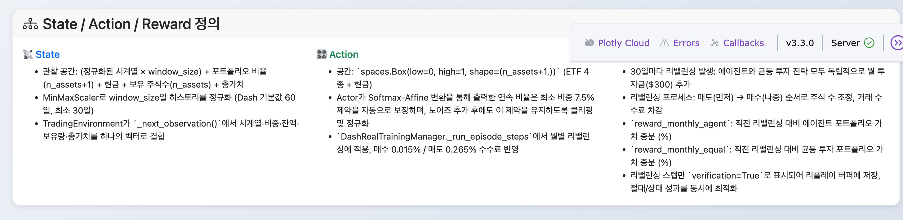

- **State**  
  - `TradingEnvironment`는 `BaseTradingEnvironment`를 상속받아 구현되었으며, `observation_space` 차원을 `(정규화된 시계열 × window_size) + 포트폴리오 비율(n_assets + 1) + 현금 잔액 + 주식 보유 수(n_assets) + 총가치`로 고정해 상태에 필요한 모든 정보를 담는다.  
  - 초기화 시 MinMaxScaler로 `window_size`일(기본값: 30일, 설정 가능 범위: 30일, 60일, 90일 등) 히스토리를 정규화하고, `_next_observation()`에서 해당 히스토리·현재 비중·잔액·주식수·총가치를 순서대로 이어붙여 단일 벡터로 반환한다.  
  - 이 구성 덕분에 시계열 맥락과 내부 포지션 변수를 동시에 관찰할 수 있으며, 상태 요소는 모두 `TradingEnvironment` 내부에서 직접 갱신된다. `BaseTradingEnvironment`는 OpenAI Gym 환경 인터페이스를 구현하여 표준화된 강화학습 환경 구조를 제공한다.

- **Action**  
  - 행동 공간은 `spaces.Box(low=0, high=1, shape=(n_assets + 1,), dtype=np.float32)`로 정의되어 ETF 4종과 현금 비중을 연속 값으로 출력하도록 강제한다.  
  - `DashRealTrainingManager._run_episode_steps`는 에이전트가 생성한 행동을 0~1로 클립한 뒤 합이 1이 되도록 정규화해 실제 리밸런싱 비율로 사용한다.  
  - 정규화된 비율은 `window_size`일(기본값: 30일)마다 호출되는 `TradingEnvironment.step()` 내부 리밸런싱 로직에 전달되어 보유 주식 수와 현금 잔액을 재조정한다. 리밸런싱 시 거래 수수료가 적용되며, 매도 시 0.265% (수수료 0.015% + 세금 0.25%), 매수 시 0.015% 수수료가 차감된다.

- **Reward**  
  - `TradingEnvironment.step()`은 마지막 리밸런싱 이후 30일(약 1개월)이 경과하면 강화학습 에이전트와 균등 투자 전략의 포트폴리오를 각각 리밸런싱하고 보상을 계산한다.
  - **리밸런싱 프로세스**:
    - 에이전트와 균등 투자 전략 모두 독립적으로 월 투자금($300)을 추가한다.
    - 에이전트는 Actor가 출력한 비율로 포트폴리오를 리밸런싱하고, 균등 투자 전략은 각 ETF에 25%씩 자동 분배한다.
    - `_rebalance_portfolio_agent()`와 `_rebalance_portfolio_equal()`이 각각 매도(먼저) → 매수(나중) 순서로 주식 수를 조정하며 수수료를 차감한다.
  - **보상 계산**:
    - `reward_monthly_agent`: 직전 리밸런싱 대비 에이전트 포트폴리오 가치 증분 (%)
    - `reward_monthly_equal`: 직전 리밸런싱 대비 균등 투자 포트폴리오 가치 증분 (%)
  - 리밸런싱 스텝만 `verification=True`로 표시되어 학습 루프에서 해당 경험만 리플레이 버퍼에 저장되며, 절대·상대 성과를 모두 최적화하도록 설계되어 있다.

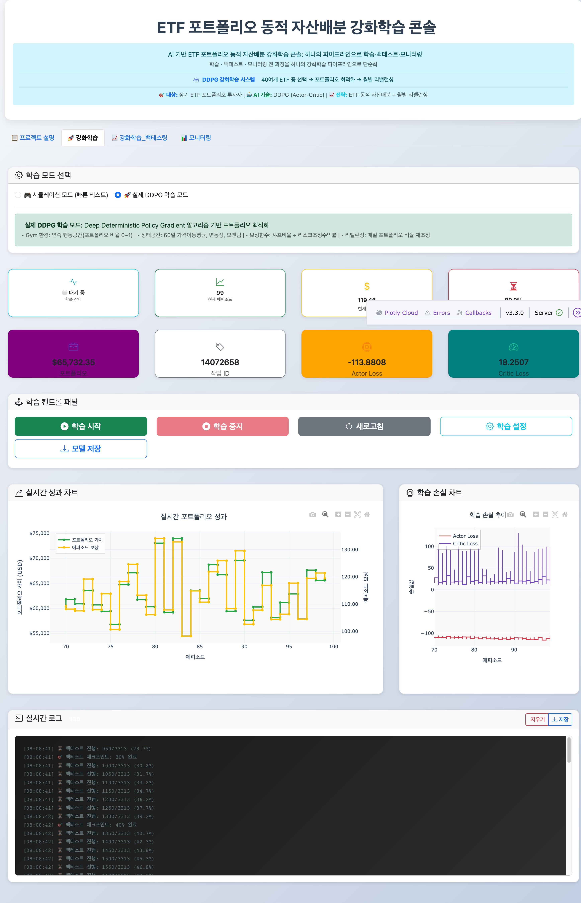

*강화학습 탭에서 DDPG 에이전트의 학습 파라미터를 설정하고 실시간으로 학습 진행 상황을 모니터링할 수 있습니다.*

### 3. 강화학습 기법 선택 근거: DDPG (Deep Deterministic Policy Gradient)

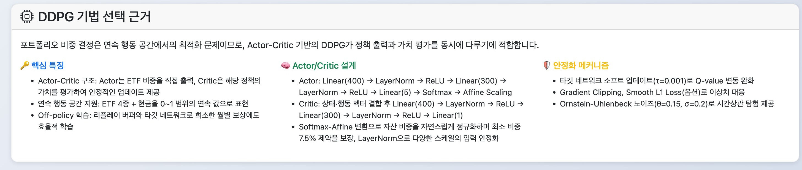

포트폴리오 동적 자산배분 문제는 **연속 행동 공간에서의 최적화 문제**로, 이산적 행동 선택이 아닌 각 자산에 대한 투자 비율(0~1 사이의 연속값)을 결정해야 한다. 이러한 특성으로 인해 **DDPG 알고리즘**을 선택했으며, 그 근거와 구현 세부사항은 다음과 같다.

#### 3.1. DDPG 알고리즘 개요 및 문제 적합성

**DDPG의 핵심 특징**:

- **Actor-Critic 구조**: Actor는 정책(포트폴리오 비중)을 직접 출력하고, Critic은 해당 정책의 가치를 평가하여 Actor를 업데이트한다. 이는 정책 기반 방법의 탐험 능력과 가치 기반 방법의 안정성을 결합한다.
- **연속 행동 공간 지원**: DQN과 같은 이산 행동 공간 알고리즘과 달리, DDPG는 연속적인 행동 값을 직접 출력할 수 있어 포트폴리오 비중 결정에 자연스럽게 적합하다.
- **Off-policy 학습**: 리플레이 버퍼를 통해 과거 경험을 재사용하여 샘플 효율성을 높이고, 월별 리밸런싱으로 인한 희소한 보상 신호를 효과적으로 활용할 수 있다.

**포트폴리오 거래 문제와의 적합성**:

- 포트폴리오 비중은 ETF 4종 + 현금으로 구성된 5차원 연속 벡터이며, 합이 1이 되어야 하는 제약 조건이 있다. DDPG의 Actor는 `torch.softmax`를 통해 자동으로 이 제약을 만족하는 확률 분포를 출력한다.
- 시장 환경은 비정상적(non-stationary)이며, 장기적 패턴과 단기적 변동성이 공존한다. DDPG의 타겟 네트워크와 소프트 업데이트 메커니즘은 이러한 환경에서 학습 안정성을 보장한다.

#### 3.2. Actor-Critic 구조 및 모델 설계

**Actor 네트워크** (`ddpg_models.py`):

- **입력**: 상태 벡터 (정규화된 30일 시계열 + 포트폴리오 상태 정보)
- **구조**: `Linear(400) → LayerNorm → ReLU → Linear(300) → LayerNorm → ReLU → Linear(5) → Softmax → Affine Scaling`
- **출력**: 각 자산에 대한 투자 비율 (합이 1인 확률 분포, 최소 비중 7.5% 제약 보장)
- **Softmax-Affine 변환**: 단순 Softmax는 0에 가까운 비중을 생성할 수 있어 최소 비중 제약을 위반할 수 있다. 이를 해결하기 위해 신경망 출력 로짓에 대해 다음과 같은 변환을 적용한다:
  - Standard Softmax: `s = Softmax(z)`
  - Affine Scaling: `w_i = ε + (1 - Nε) × s_i`
  - 여기서 `ε = 0.075` (최소 비중 7.5%), `N = 5` (자산 수: ETF 4종 + 현금)
  - 수학적 검증: `Σw_i = Nε + (1 - Nε) × 1 = 1`, `w_i ≥ ε = 0.075`
- **초기화**: Fan-in 초기화를 통해 각 층의 입력 차원에 비례한 가중치 분산을 설정하여 그래디언트 폭주를 방지한다. 최종 출력층은 `uniform(-3e-3, 3e-3)`로 작은 값으로 초기화하여 학습 초기 안정성을 확보한다.

**Critic 네트워크** (`ddpg_models.py`):

- **입력**: 상태 벡터와 행동 벡터를 concat한 벡터
- **구조**: `Linear(400) → LayerNorm → ReLU → Linear(300) → LayerNorm → ReLU → Linear(1)`
- **출력**: 상태-행동 쌍의 Q-value (스칼라)
- **역할**: 특정 포트폴리오 배분이 주어진 시장 상태에서 얼마나 유리한지를 평가하여 Actor의 정책 개선을 유도한다.

**LayerNorm의 중요성**:

- 시계열 데이터의 스케일이 다양하고, 포트폴리오 상태 정보(잔액, 주식수, 총가치)가 정규화되지 않은 원본 값이므로, 각 층에서 LayerNorm을 적용하여 내부 공변량 이동(internal covariate shift)을 완화하고 학습 안정성을 향상시킨다.

#### 3.3. 학습 안정화 메커니즘

**타겟 네트워크 및 소프트 업데이트** (`ddpg_agent.py`):

- **메인 네트워크**: Actor와 Critic의 메인 네트워크는 매 배치마다 업데이트된다.
- **타겟 네트워크**: Actor와 Critic의 타겟 네트워크는 메인 네트워크의 복사본으로, Q-value 타겟 계산에 사용된다.
- **소프트 업데이트**: 타겟 네트워크는 `tau=0.001`의 작은 비율로만 업데이트되어 (`target_param = target_param * (1-tau) + main_param * tau`), 타겟 값의 급격한 변화를 방지하고 학습 안정성을 확보한다. 이는 DQN의 하드 업데이트(주기적 복사)보다 더 부드러운 학습 곡선을 제공한다.

**리플레이 버퍼 전략**:

- 월별 리밸런싱 시점의 경험만 저장하여 샘플 상관관계를 줄이고, 오프-폴리시 학습을 통해 다양한 과거 경험을 재사용한다.
- 리플레이 버퍼 크기는 `maxlen=100000`으로 설정하여 충분한 경험을 보관하면서도 메모리 효율성을 유지한다.
- 배치 크기 128로 설정하여 충분한 샘플 다양성을 확보하면서도 학습 속도를 유지한다.

**학습 프로세스** (`DDPGAgent.update`):

1. **Critic 업데이트**: 타겟 네트워크로 계산한 Q-value 타겟과 현재 Q-value의 손실을 최소화한다.
   - **Critic Loss 계산**: 기본적으로 `F.mse_loss(current_q, target_q.detach())`를 사용하며, `critic_loss_type='smooth_l1'`로 설정 시 `F.smooth_l1_loss`를 사용할 수 있다.
   - **Loss 함수 선택**:
     - **MSE Loss (기본값)**: 제곱 연산을 사용하여 큰 오차에 더 민감하게 반응한다. 일반적인 상황에서 안정적인 학습을 제공한다.
     - **Smooth L1 Loss (옵션)**: 이상치(outlier)에 더 robust하며, 큰 오차에 대해 선형적으로 반응하여 학습 안정성을 향상시킬 수 있다.
   - **수학적 의미**: Critic이 예측한 Q값(`current_q`)과 타겟 Q값(`target_q`)의 차이를 측정한 값이다.
   - **부호 특성**: 두 loss 함수 모두 **항상 양수**이다. 값이 작을수록 Critic의 예측이 정확하다는 의미이다.
   - **해석**: Critic Loss가 낮게 유지되면 Critic 네트워크가 상태-행동 쌍의 가치를 정확히 평가하고 있다는 신호이다.
   - **Gradient Clipping**: Critic 업데이트 후 `nn.utils.clip_grad_norm_(self.critic.parameters(), max_grad_norm=0.5)`를 적용하여 그래디언트 폭주를 방지하고 학습 안정성을 향상시킨다.

2. **Actor 업데이트**: Critic이 평가한 Q-value를 최대화하는 방향으로 정책 경사(policy gradient)를 계산하여 Actor를 업데이트한다.
   - **Actor Loss 계산**: `actor_loss = -self.critic(states, self.actor(states)).mean()`
   - **수학적 의미**: Actor가 선택한 행동에 대한 Q값의 **음수**이다. 즉, `-Q(s, π(s))` 형태이다.
   - **부호가 음수인 이유**:
     - Actor의 목표는 Q값을 **최대화**하는 것이다.
     - 하지만 최적화 알고리즘은 손실 함수를 **최소화**하는 방향으로 동작한다.
     - 따라서 Q값에 음수 부호를 붙여서 최소화 문제로 변환한다: `minimize(-Q) = maximize(Q)`
   - **해석**: Actor Loss의 절댓값이 커질수록(더 음수로 감소) Actor가 더 높은 Q값을 선택하는 행동을 학습하고 있다는 의미이다. 학습이 잘 진행되면 Actor Loss는 점진적으로 음수 방향으로 감소한다.
   - **Gradient Clipping**: Actor 업데이트 후 `nn.utils.clip_grad_norm_(self.actor.parameters(), max_grad_norm=0.5)`를 적용하여 그래디언트 폭주를 방지하고 학습 안정성을 향상시킨다.

3. **타겟 네트워크 소프트 업데이트**: 두 네트워크의 타겟 버전을 점진적으로 동기화한다.

#### 3.4. 탐험 전략: Ornstein-Uhlenbeck 노이즈

**OUNoise의 특성** (`ddpg_noise.py`):

- **평균 회귀 프로세스**: `dx = theta * (mu - x) + sigma * random_noise` 형태로, 노이즈가 시간에 따라 평균값(0)으로 회귀하는 특성을 가진다.
- **시간적 상관성**: 순수한 가우시안 노이즈와 달리, OU 노이즈는 이전 상태에 의존하여 생성되므로 연속된 행동 간에 부드러운 전환을 제공한다. 이는 포트폴리오 리밸런싱에서 급격한 비중 변화를 방지하고 현실적인 거래 패턴을 학습하게 한다.
- **파라미터 설정**: `theta=0.15` (평균 회귀 속도), `sigma=0.2` (노이즈 강도)로 설정하여 충분한 탐험을 유지하면서도 안정적인 정책 수렴을 보장한다.

**행동 선택 및 정규화** (`DDPGAgent.select_action`):

- Actor의 Softmax-Affine 변환 출력(이미 최소 비중 7.5% 제약 보장)에 OU 노이즈를 추가한 후, 최소 비중 제약을 유지하면서 클리핑하고 합이 1이 되도록 정규화하여 유효한 포트폴리오 비중을 보장한다.
- 노이즈 추가 후에도 각 자산과 현금의 비중이 최소 7.5% 이상이 되도록 보장하는 클리핑 로직을 적용한다.
- 평가 모드에서는 노이즈를 제거하여 학습된 정책의 성능을 순수하게 평가한다.

#### 3.5. 하이퍼파라미터 및 최적화 설정

**학습률 및 정규화**:

- Actor 학습률: `3e-4`, Critic 학습률: `3e-4`로 동일하게 설정하여 두 네트워크의 학습 속도 균형을 맞춘다.
- Weight decay: `1e-4`로 설정하여 L2 정규화를 통해 과적합을 방지한다.
- 할인 인수(Gamma): `0.99`로 설정하여 장기 수익을 중시한다.

**Gradient Clipping 및 Loss 함수**:

- **Gradient Clipping**: `max_grad_norm=0.5`로 설정하여 Actor와 Critic 네트워크의 그래디언트를 클리핑한다. 이는 그래디언트 폭주를 방지하고 학습 안정성을 크게 향상시킨다. 강의 예제 코드(`ex014_ddpg.py`)의 best practice를 반영한 개선 사항이다.
- **Critic Loss 함수**: 기본값은 `mse` (Mean Squared Error)이며, `critic_loss_type='smooth_l1'`로 설정 시 Smooth L1 Loss를 사용할 수 있다. Smooth L1 Loss는 이상치에 더 robust하여 학습 안정성을 향상시킬 수 있다.

**네트워크 구조**:

- 은닉층 차원: Actor와 Critic 모두 내부적으로 `[400, 300]` 고정 구조를 사용하여 충분한 표현력을 확보하면서도 계산 효율성을 유지한다. `DDPGAgent` 초기화 시 `hidden_dim` 파라미터는 다른 용도로 사용될 수 있으나, 실제 네트워크 구조는 `ddpg_models.py`에서 고정된 `[400, 300]` 구조를 사용한다.
- 배치 크기: 128로 설정하여 학습 안정성과 효율성의 균형을 맞춘다.
- 타겟 네트워크 업데이트: 소프트 업데이트 방식(`tau=0.001`)을 사용하여 매 학습 스텝마다 타겟 네트워크를 점진적으로 업데이트한다. 이는 예제 코드의 주기적 하드 업데이트 방식보다 더 안정적인 학습 곡선을 제공한다.

#### 3.6. 구현 검증 및 강의 예제 코드 대비 개선 사항

본 프로젝트의 DDPG 구현은 강의 슬라이드(`RL_Slides_07.pdf`)와 예제 코드(`ex014_ddpg.py`)를 기준으로 검증되었으며, 포트폴리오 최적화 도메인에 맞게 적응되었습니다.

**검증 결과**:

- ✅ **Actor-Critic 구조**: 올바르게 구현됨. Actor는 정책(포트폴리오 비중)을 출력하고, Critic은 해당 정책의 가치를 평가합니다.
- ✅ **타겟 네트워크**: 소프트 업데이트 방식(`tau=0.001`)을 사용하여 예제 코드의 주기적 하드 업데이트보다 더 안정적인 학습을 제공합니다.
- ✅ **Replay Buffer**: `deque`를 사용하여 효율적인 경험 저장 및 샘플링을 구현했습니다.
- ✅ **OUNoise**: 연속 행동 공간에 적합한 Ornstein-Uhlenbeck 노이즈를 사용하여 탐험을 수행합니다.
- ✅ **네트워크 구조**: 포트폴리오 최적화에 맞게 더 복잡한 구조(400→300, LayerNorm)를 사용하여 표현력을 향상시켰습니다.

**개선 사항 (강의 예제 코드 기준)**:

- ✅ **Gradient Clipping 추가**: 예제 코드의 `max_grad_norm=0.5`를 반영하여 Actor와 Critic 네트워크 모두에 gradient clipping을 적용했습니다. 이는 그래디언트 폭주를 방지하고 학습 안정성을 크게 향상시킵니다.
- ✅ **Loss 함수 옵션**: Critic loss 함수에 `smooth_l1_loss` 옵션을 추가했습니다. 기본값은 `mse_loss`를 유지하지만, 이상치에 더 robust한 `smooth_l1_loss`를 선택할 수 있습니다.
- ✅ **타겟 네트워크 업데이트**: 예제 코드의 주기적 하드 업데이트 대신 소프트 업데이트 방식을 사용하여 더 부드러운 학습 곡선을 제공합니다.

#### 3.7. 재현성 및 운영성 보장

**체크포인트 시스템** (`DDPGAgent.save_checkpoint`):

- Actor/Critic의 메인 및 타겟 네트워크 상태, 옵티마이저 상태를 모두 저장하여 학습을 정확히 재개할 수 있다.
- 체크포인트는 두 곳에 저장된다:
  - 작업 ID 기반 디렉토리: `model/rl_ddpg_{task_id}/checkpoint_{episode:04d}.pth` 및 `checkpoint_last.pth`
  - 최신 체크포인트 디렉토리: `model/rl_ddpg_latest/checkpoint_{episode:04d}.pth` 및 `checkpoint_last.pth`
- 학습 메타데이터(에피소드 수, 하이퍼파라미터, ETF 조합, 학습 시간 통계 등)를 JSON 파일(`metadata_{episode:04d}.json`, `metadata_last.json`)로 별도 저장하여 실험 추적성을 확보한다.

**평가 모드 최적화** (`DDPGAgent.load_checkpoint`):

- 평가 시 노이즈를 리셋하고 타겟 네트워크를 메인 네트워크와 완전 동기화하여 일관된 성능 평가를 보장한다.
- 액션 다양성 검증을 통해 모델이 한쪽으로 치우치지 않았는지 확인한다.

**실험 추적**:

- 각 체크포인트에 타임스탬프와 학습 설정을 기록하여 실험 간 비교와 재현을 용이하게 한다.
- 모델 저장 시 에피소드 번호와 함께 저장하여 학습 진행 상황을 명확히 추적할 수 있다.

### 4. Python 구현 및 실험 파이프라인

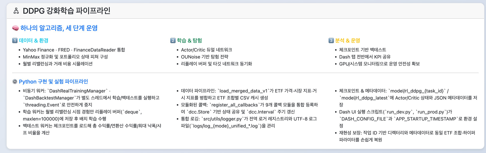

본 프로젝트는 **비동기 워커 스레드 패턴**을 채택하여 Dash 웹 인터페이스의 응답성을 유지하면서 장시간 실행되는 강화학습 학습 및 백테스트 작업을 처리한다.

**비동기 워커 아키텍처** (`src/training/training_manager.py`, `backtest_manager.py`):

- `DashRealTrainingManager`와 `DashBacktestManager`는 `threading.Thread`를 사용하여 데몬 스레드로 학습/백테스트를 실행한다. `threading.Event`를 통해 안전한 중지 메커니즘을 제공하며, 콜백 함수(`log_callback`, `status_callback`, `result_callback`)를 통해 실시간 상태 업데이트를 구현한다.
- 학습 워커는 `_training_thread_worker`에서 `TradingEnvironment`와 `DDPGAgent`를 초기화하고, 에피소드 루프에서 월별 리밸런싱 시점(`verification=True`)의 경험만 리플레이 버퍼(`deque`, `maxlen=100000`)에 저장한 후 배치 학습을 수행한다. 백테스트 워커는 `_backtest_worker`에서 체크포인트를 로드하고 평가 모드로 실행하여 성과 지표(총 수익률, 연환산 수익률, 최대 낙폭, 샤프 비율 등)를 계산한다.

**데이터 소스 및 전처리** (`src/data/`):

- ETF 데이터는 `FinanceDataReader`를 통해 수집되며, 시장 지표 데이터는 `FRED` (Federal Reserve Economic Data) API를 통해 경제 지표를 가져온다.
- `load_merged_data_v1` 함수는 ETF 가격 데이터, 시장 지표 데이터(VIX 등), 경제 지표 데이터를 병합하여 통합 데이터셋을 생성한다. 데이터는 `data/` 디렉토리에 CSV 파일로 캐시되며, ETF 조합별로 고유한 파일명을 사용한다.

**모듈화된 콜백 시스템** (`src/callbacks/`):

- `register_all_callbacks` 함수가 9개의 콜백 모듈(`training_callbacks`, `backtest_callbacks`, `model_callbacks`, `chart_callbacks`, `etf_callbacks`, `monitoring_callbacks`, `config_callbacks`, `log_callbacks`, `ai_platform_callbacks`)을 통합 등록한다. 각 콜백은 Dash의 `dcc.Store` 컴포넌트를 통해 상태를 공유하고, `dcc.Interval`을 사용한 주기적 폴링으로 UI를 자동 갱신한다.

**통합 로깅 시스템** (`src/utils/logger.py`):

- 전역 로거 레지스트리를 통해 중복 핸들러를 방지하고, 모든 모듈이 동일한 통합 로그 파일(`logs/log_{mode}_unified_{timestamp}.log`)을 공유한다. 파일 핸들러와 콘솔 핸들러를 모두 사용하여 CLI와 파일에서 동일한 로그를 확인할 수 있으며, UTF-8 인코딩으로 한글 로그를 정확히 기록한다.
- 로그 파일명은 실행 모드(`dev`, `prod`, `app`)와 앱 시작 타임스탬프(`APP_STARTUP_TIMESTAMP`)를 기반으로 생성되며, 환경변수 `DASH_CONFIG_FILE`을 통해 모드를 자동 감지한다.

**체크포인트 및 메타데이터 관리**:

- 작업 ID 기반 디렉토리 구조(`model/rl_ddpg_{task_id}/`, `model/rl_ddpg_latest/`)로 각 실험을 구분하고, PyTorch 체크포인트(`.pth`)와 JSON 메타데이터를 함께 저장하여 학습 재개와 실험 추적을 지원한다. 모든 하이퍼파라미터와 환경 설정을 메타데이터에 저장하여 재현성을 보장한다.

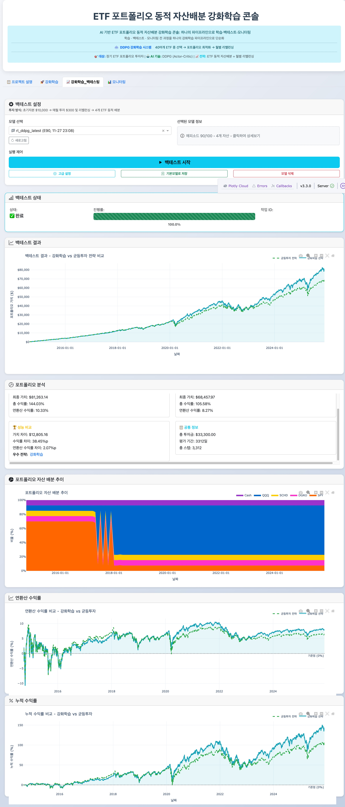

*백테스팅 탭에서 학습된 모델을 선택하여 과거 데이터로 전략의 성과를 검증하고 분석할 수 있습니다.*

### 5. 실험 결과 및 보고 체계

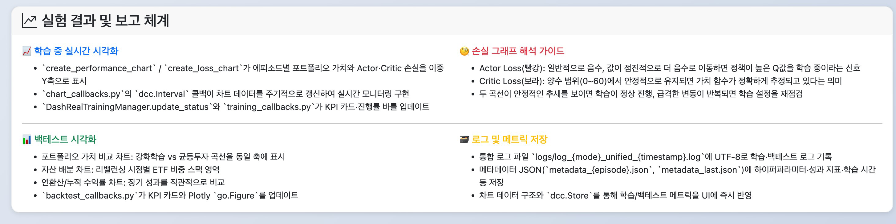

본 프로젝트는 학습 중 실시간 시각화와 백테스트 결과 분석을 통해 학습 안정성과 전략 성과를 종합적으로 평가한다.

**학습 중 실시간 시각화** (`src/dash_charts.py`, `src/callbacks/chart_callbacks.py`):

- `create_performance_chart`는 포트폴리오 가치와 에피소드 보상을 이중 Y축으로 표시하는 실시간 성과 차트를 생성한다. `create_loss_chart`는 Actor와 Critic의 손실 곡선을 시각화하여 학습 안정성을 모니터링한다. `chart_callbacks.py`의 `dcc.Interval` 콜백이 주기적으로 차트 데이터를 업데이트하여 학습 진행 상황을 실시간으로 반영한다.
- `DashRealTrainingManager.update_status`는 에피소드별 포트폴리오 가치, 누적 보상, Actor/Critic 손실, 진행률을 콜백을 통해 UI에 전달하고, `training_callbacks.py`의 상태 표시 콜백이 이를 KPI 카드와 진행률 바로 변환한다.

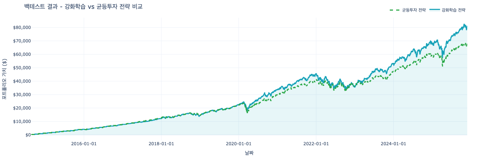

*학습 중 포트폴리오 가치와 에피소드 보상의 변화를 실시간으로 모니터링할 수 있습니다.*

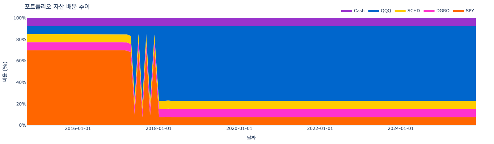

*Actor와 Critic 네트워크의 손실 곡선을 통해 학습 안정성을 확인할 수 있습니다.*

**학습 손실 그래프 해석 가이드**:

학습을 시작하면 "학습 손실 차트"에 두 개의 곡선이 표시된다:

- **Actor Loss (빨간색 선)**:
  - **값의 범위**: 일반적으로 음수 값(-70 ~ 0 정도)을 가진다.
  - **정상적인 학습 패턴**: 학습이 진행될수록 점진적으로 음수 방향으로 감소한다 (예: 0 → -10 → -25 → -35 → -70).
  - **의미**: 절댓값이 커질수록(더 음수로 감소) Actor가 더 높은 Q값을 선택하는 행동을 학습하고 있다는 신호이다. 이는 학습이 잘 진행되고 있다는 의미이다.
  - **주의사항**: Actor Loss가 계속 증가하거나(0에 가까워짐) 불안정하게 변동하면 학습이 불안정할 수 있다.

- **Critic Loss (보라색 선)**:
  - **값의 범위**: 항상 양수 값(0 ~ 60 정도)을 가진다.
  - **정상적인 학습 패턴**: 일반적으로 낮은 값(5~10 정도)을 유지하면서, 학습 중 일시적으로 스파이크가 발생할 수 있다.
  - **의미**: Critic이 예측한 Q값과 실제 타겟 Q값의 차이를 나타낸다. 값이 작을수록 Critic의 예측이 정확하다는 의미이다.
  - **주의사항**: Critic Loss가 지속적으로 높거나 급격히 증가하면 Critic 네트워크의 학습이 불안정할 수 있다. 일시적인 스파이크는 정상적인 현상이며, 학습이 진행되면서 점진적으로 안정화된다.

- **그래프 해석 요약**:
  - **좋은 학습 신호**: Actor Loss가 점진적으로 음수 방향으로 감소하고, Critic Loss가 낮은 값(5~10)을 유지하면서 안정적인 경우
  - **학습 진행 확인**: 두 손실 모두 시간에 따라 안정적인 추세를 보이면 학습이 정상적으로 진행되고 있다고 판단할 수 있다

**백테스트 결과 분석 및 시각화** (`src/training/backtest_manager.py`, `src/dash_charts.py`):

- `_calculate_final_metrics`는 강화학습 전략과 균등투자 전략의 총 수익률, 연환산 수익률, 최종 포트폴리오 가치를 계산하고 비교한다. 두 전략은 동일한 초기 자본과 월 투자금으로 시작하여 공정한 비교가 이루어진다.
- 시각화 차트 종류:
  - **포트폴리오 가치 비교 차트** (`create_backtest_results_chart`): 강화학습 전략과 균등투자 전략의 포트폴리오 가치 곡선을 시간에 따라 비교하여 시각화한다.
  - **자산 배분 차트** (`create_portfolio_allocation_chart`): 리밸런싱 시점별 자산별 투자 비중을 스택 영역 차트로 표현하여 전략의 자산 배분 패턴을 분석한다.
  - **연환산 수익률 차트** (`create_annualized_returns_chart`): 두 전략의 연환산 수익률을 시간에 따라 비교하여 장기 성과를 평가한다.
  - **누적 수익률 차트** (`create_cumulative_returns_chart`): 두 전략의 누적 수익률을 시간에 따라 비교하여 전체 기간 동안의 성과를 분석한다.
- `backtest_callbacks.py`는 계산된 메트릭을 KPI 카드로 표시하고, 모든 차트를 Plotly의 `go.Figure` 객체로 생성하여 인터랙티브한 분석을 제공한다. 백테스트 결과는 `update_results` 콜백을 통해 `dcc.Store`에 저장되고 UI에 자동 반영된다.

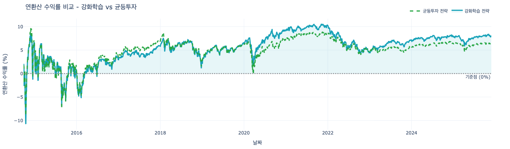

*강화학습 전략과 균등투자 전략의 포트폴리오 가치를 시간에 따라 비교하여 전략의 성과를 평가할 수 있습니다.*

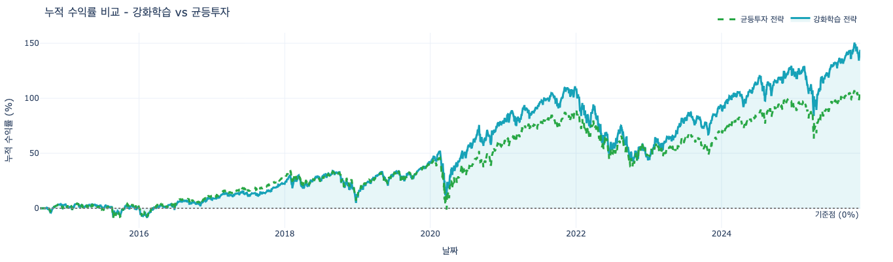

*리밸런싱 시점별 자산별 투자 비중을 시각화하여 전략의 자산 배분 패턴을 분석할 수 있습니다.*

**로그 및 메트릭 저장**:

- 모든 로그는 통합 로그 파일(`logs/log_{mode}_unified_{timestamp}.log`)에 UTF-8 인코딩으로 저장되며, 학습/백테스트 중 발생하는 메트릭은 실시간으로 차트 데이터 구조에 추가된다. 체크포인트와 함께 저장되는 JSON 메타데이터에는 학습 설정, 성과 지표, 실행 시간 등이 포함되어 실험 추적과 재현성을 보장한다.

### 7. 재현성 보장 메커니즘

본 프로젝트는 환경변수 기반 설정 시스템과 체크포인트 메커니즘을 통해 실행 환경의 일관성과 실험 재현성을 보장합니다.

**체크포인트 시스템**:

- `DDPGAgent.save_checkpoint`는 Actor/Critic 메인 및 타겟 네트워크 상태, 옵티마이저 상태, 에피소드 번호를 PyTorch 체크포인트(`.pth`)로 저장합니다.
- 체크포인트는 작업 ID 기반 디렉토리와 최신 체크포인트 디렉토리 두 곳에 저장됩니다.

**백테스트 재현성**:

- `DashBacktestManager._setup_backtest_environment`는 체크포인트에서 학습 메타데이터를 로드하여 모델이 학습된 정확한 설정(ETF 조합, 윈도우 크기, 학습률 등)을 복원합니다.
- 평가 모드(`evaluate=True`)로 모델을 로드하여 노이즈를 제거하고 타겟 네트워크를 동기화하여 일관된 성능 평가를 보장합니다.

**작업 ID 기반 파일 관리**:

- 각 실험은 고유한 작업 ID(`uuid`)로 구분되며, `model/rl_ddpg_{task_id}/` 디렉토리에 모든 관련 파일이 저장되어 실험 단위로 추적 및 재현이 가능합니다.

## 📚 추가 참고 문서

- 프로젝트 구조·탭·UI 상세: `docs/architecture_and_tabs.md`  
- 실행 방법·환경 설정·운영 가이드: `docs/project_runbook.md`


---

**주의**: 이 시스템은 교육 및 연구 목적으로 설계되었습니다. 실제 투자에 사용하기 전 충분한 검증이 필요합니다.
